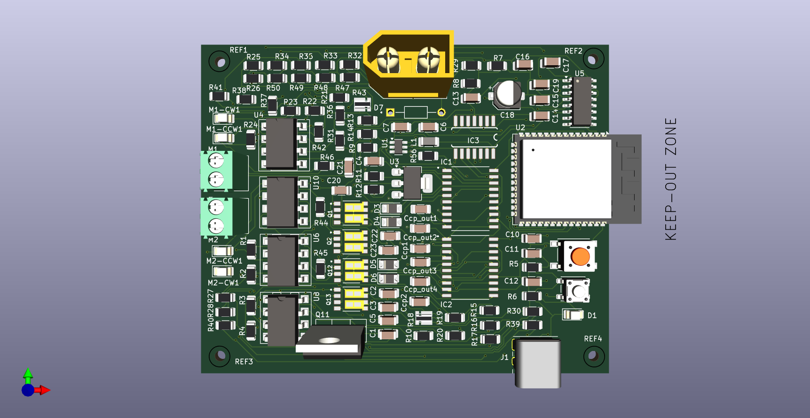
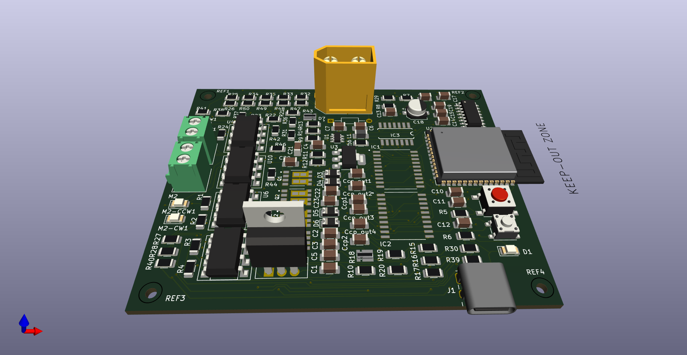
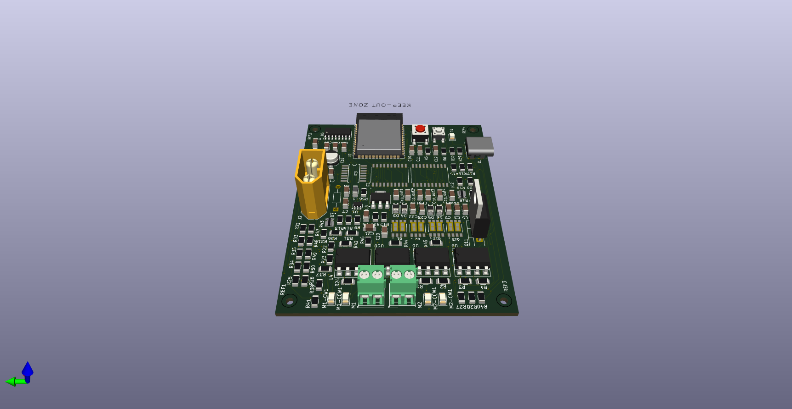
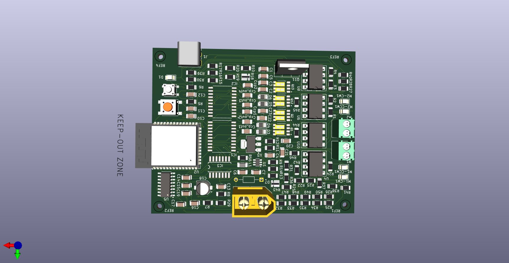
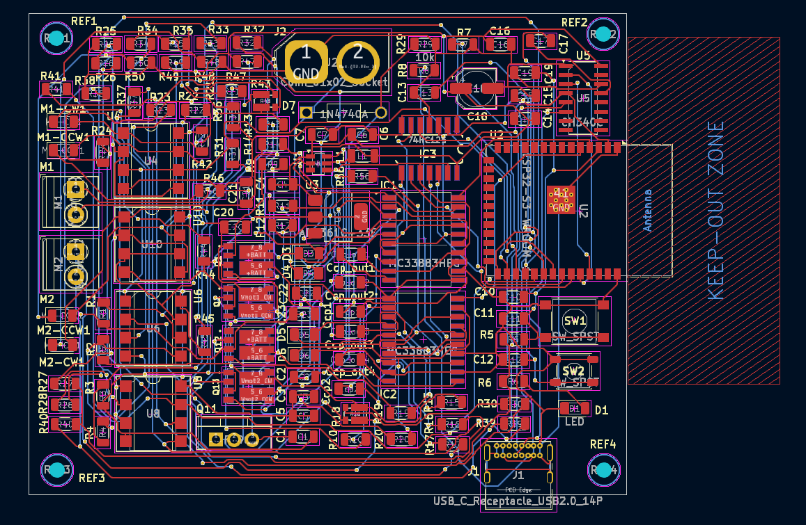

# smart-motor-driver-kicad
A high-efficiency 60V/40A smart motor driver with real-time current and voltage sensing, reverse polarity protection, and a cost-optimized PCB design
Smart Motor Driver – Kicad

This repository contains the complete design and documentation for a smart motor driver capable of driving two high-current DC motors (up to 60V, 40A each) with real-time voltage and current sensing. The driver is built using discrete components, and gate drivers for H-bridge MOSFET control. It is designed for high-efficiency operation, integrated protection, and microcontroller-based control.

The project includes the full schematic, PCB layout, firmware interface, and performance analysis. It is intended for embedded system applications such as robotics, automation, and motorized systems requiring efficient and protected motor drive control.

---
# Project Features
- **Dual Channel Motor Drive**: Two independent H-Bridge circuits with dedicated gate drivers.
- **High Voltage and Current Support**: Operates at up to 60V input and handles continuous motor current up to 40A per channel.
- **High Efficiency**: Optimized gate drive timing, low-loss power MOSFETs, and minimized switching losses provide efficiency above 90% under load.
- **Current and Voltage Feedback**: Op-amp-based analog sensing circuits for real-time current and voltage monitoring with ±1% accuracy.
- **Reverse Polarity Protection**: Input protection circuit safeguards the board from accidental reverse connections.
- **Microcontroller Interface**: PWM-compatible logic-level inputs for speed and direction control 
- **Integrated Voltage Regulation**: Onboard buck regulators generate 5V and 3.3V rails for logic and sensors.
- **USB-to-Serial Interface**: Using a USB-to-Serial converter (CH340-C) for real-time data logging, motor control, and firmware debugging via serial terminal.
- **Modular Design**: Separated sections for control logic, power stages, sensing, and regulation.

---

## Schematic Highlights

- **Power Section**: Includes reverse polarity protection, input filtering, and buck converters (AP63205WU, AP7316-C) for 5V and 3.3V rails.
- **Gate Drivers**: MC33883 used to drive the high- and low-side N-channel MOSFETs for each H-bridge.
- **Motor Channels**: Two H-Bridge configurations, each with four MOSFETs and flyback diodes for inductive protection.
- **Current Sensing**: Differential amplifier circuits with op-amps (LM358) for low-side current sensing on each motor.
- **Voltage Monitoring**: Voltage divider and op-amp buffer stages for voltage feedback to the controller.
- **Microcontroller Interface**: PWM signal lines, direction pins, and feedback outputs prepared for logic-level interfacing.

---

## Tools and Components Used

- **Schematic & PCB Design**: KiCad
- **Analog Simulation**: Proteus
- **Gate Driver**: MC33883
- **Microcontroller Target**: ESP32
- **Op-Amps**: LM358 (for current and voltage sensing)
- **MOSFETs**: N-channel high-current rated, low Rds(on)
- **Voltage Regulators**: AP63205WU, AP7316-C for 5V and 3.3V and 74HCT244 for level shifting
- **Other Tools**: Proteus (for logic testing), T-Cad (device simulation reference)

---

## Applications

- Custom embedded robotic platforms
- Industrial or academic motor control systems

---

## Performance Summary

- **Efficiency**: >90% at full load
- **Current Measurement Error**: ±1% (tested using calibrated load)
- **MOSFET Temperature Rise**: Within safe limits under continuous 30A drive with proper heat dissipation
- **Cost**: 40% lower than comparable commercial motor drivers with similar specs

---
[View Schematic (PDF)](Schematic.pdf)
---

---

---

---

---

---

